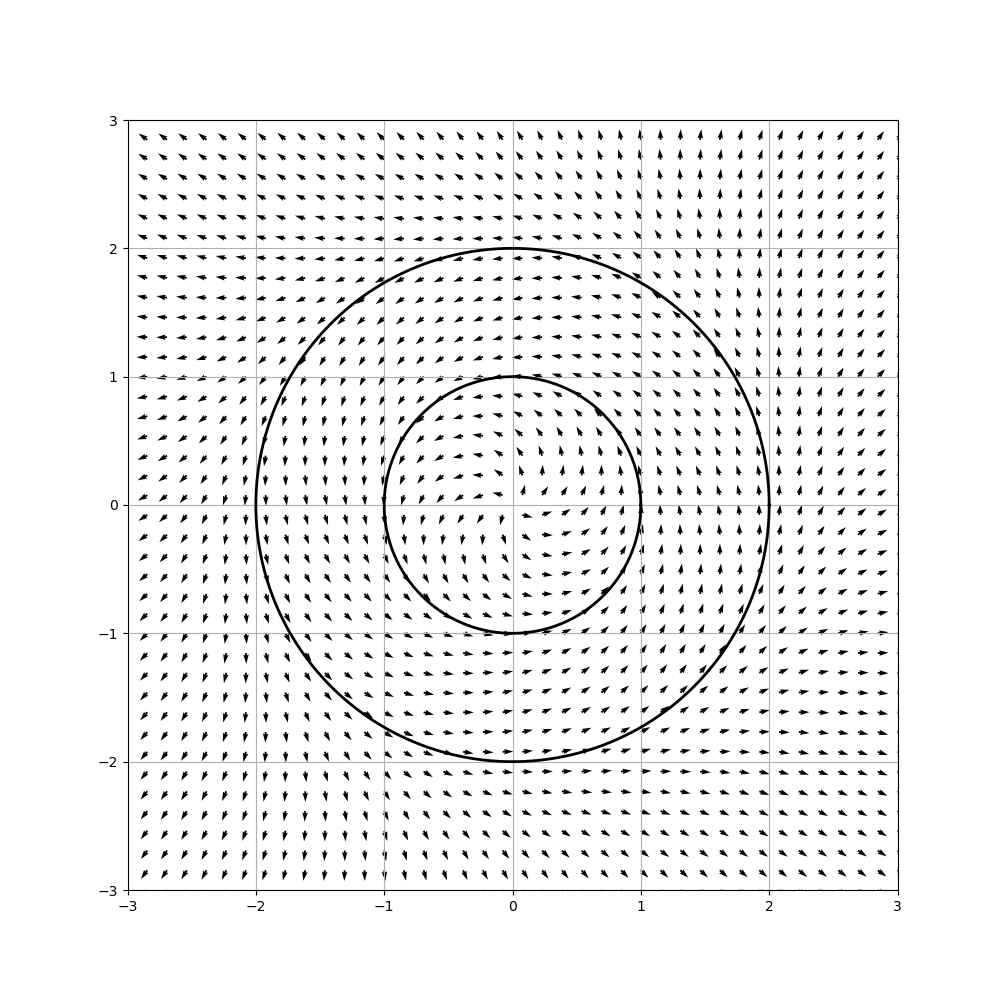
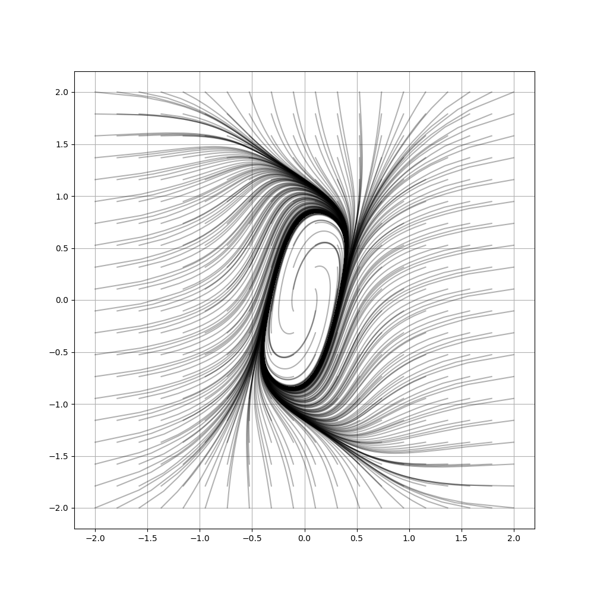

# Assignment 6

Arsen Nuramatov

Group 2

## More on limit cycles

### Exercise 1.1

$$
\begin{aligned}
& \dot\theta = \omega    \\
& \dot r = r (r-1) (r-2) \\
\end{aligned}
$$

{width=300 height=300}

- $r=0$ - unstable FP
- $r=1$ - stable LC
- $r=2$ - unstable LC

### Exercise 1.2

$$
\begin{aligned}
& \dot x = y^2 - x        \\
& \dot y = y + x^2 + yx^3 \\
\end{aligned}
$$

Jacobian:

$$
J = \begin{pmatrix}
-1         & 2y      \\
2x + 3yx^2 & 1 + x^3 \\
\end{pmatrix}
$$

Fixed point:

$$
\begin{aligned}
& y^2 = x           \\
& y + y^7 + y^4 = 0 \\
& x = y = 0         \\
\end{aligned}
$$

$$
J = \begin{pmatrix}
-1         & 0       \\
0          & 1       \\
\end{pmatrix}
$$

$$
\sigma = \pm 1
$$

The only fixed point is a saddle point $\implies$ no limit cycles.

### Exercise 1.3

$$
\begin{aligned}
& \dot x = y - 8x^3     \\
& \dot y = 2y -4x -2y^3 \\
\end{aligned}
$$

Jacobian:

$$
J = \begin{pmatrix}
-24x^2  & 1        \\
-4      & 2 - 6y^2 \\
\end{pmatrix}
$$

Fixed point:

$$
\begin{aligned}
& y = 8x^3 \\
& 2^4x^3 - 2^2x - 2^{10}x^9 = 0 \\
& x = y = 0 \\
\end{aligned}
$$

$$
J = \begin{pmatrix}
0  & 1        \\
-4 & 2 \\
\end{pmatrix}
$$

$$
\sigma = 1 \pm i \sqrt{3}
$$

$\Re\sigma > 0 \implies$ the FP is a source

Now consider a subset of the plane 
$R = \{-2 \leq x \leq 2, -2 \leq y \leq 2, x^2 + y^2 \geq \varepsilon\}$:

\begin{tikzpicture}
 \draw[thin, ->] (-3,0) -- (3,0) node[anchor=north west] {x};
 \draw[thin, ->] (0,-3) -- (0,3) node[anchor=south east] {y};
 \draw[fill=black!20] (-2,-2) rectangle (2,2);
 \draw[fill=white] (0,0) circle (0.1cm);
 \draw (0,0) node[anchor=north east] {$(0,0)$};
\end{tikzpicture}

$\exists \varepsilon:$ from the inner border of $R$ the flow field goes 
into $R$.

$$
\begin{aligned}
x=-2: & \quad \dot x = y + 64 > 0 & \quad \forall y \in [-2,2] \\
x=2:  & \quad \dot x = y - 64 < 0 & \quad \forall y \in [-2,2] \\
y=-2: & \quad \dot y = 12 - 4x > 0 & \quad \forall x \in [-2,2] \\
y=2:  & \quad \dot y = -12 - 4x < 0 & \quad \forall x \in [-2,2] \\
\end{aligned}
$$

Thus the flow from the outer border of $R$ also goes into $R \implies R$ 
contains at least one closed orbit.

{width=300 height=300}

## SIR model with demography

$$
\begin{aligned}
& \dot S = \mu N - \beta IS - \mu S \\
& \dot I = \beta IS - \gamma I - \mu I \\
& \dot R = \gamma I - \mu R \\
\end{aligned}
$$

### Exercise 2.1

Positive term $\mu N$ in $\dot S$ corresponds to birth rate, and negative 
terms $\mu S, \mu I, \mu R$ correspond to death rate.

$$
\begin{aligned}
& \dot S + \dot I + \dot R = \dot N = 0 \\
& \dot R = - \dot S - \dot I \\
& R = N - S - I \\
\end{aligned}
$$

### Exercise 2.2

$$
\begin{aligned}
& \dot S = \mu (N - S) - \beta IS \\
& \dot I = I (\beta S - \gamma - \mu) \\
& [b/N = \beta, iN = I, sN = S]\\
& \dot s = \mu (1 - s) - bis \\
& \dot i = i (b s - \gamma - \mu) \\
\end{aligned}
$$

### Exercise 2.3

$\mu = 1, \beta = \frac{1}{2}$

{width=300 height=300}

{width=300 height=300}

## Lorenz model

$$
\begin{aligned}
& \dot x = \sigma (y-x) \\
& \dot y = Rx - y - xz \\
& \dot z = xy - bz \\
\end{aligned}
$$

### Exercise 3.1

$$
\begin{aligned}
& \dot x = 0 \implies y = x \\
& \dot y = 0 \implies z = R-1 \\
& \dot z = 0 \implies x = y = \pm \sqrt{b(R-1)} \\
\end{aligned}
$$

### Exercise 3.2

$$
J = \begin{pmatrix}
-\sigma & \sigma & 0  \\
R       & -1     & 0  \\
0       & 0      & -b \\
\end{pmatrix}
$$

$$
\begin{aligned}
& \lambda_3 = -b < 0 \\
& \lambda_{1,2} = 
\frac{-\sigma - 1 \pm \sqrt{(-\sigma-1)^2 - 4\sigma(1-R)}}{2} \\
& \lambda_2 < 0 \quad \\
& R < R^c_1 = 1 \implies \lambda_1 < 0 \\
& R > R^c_1 = 1 \implies \lambda_1 > 0 \\
\end{aligned}
$$

$(0,0,0)$ is stable at $R < R^c_1$ and unstable at $R > R^c_1$.

### Exercise 3.3

$$
J = \begin{pmatrix}
-\sigma & \sigma & 0  \\
R       & -1     & -x  \\
y       & x      & -b \\
\end{pmatrix}
$$
